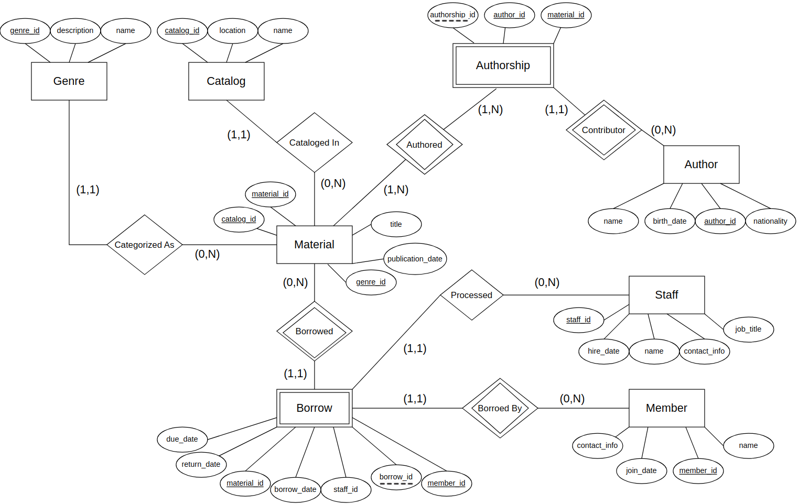
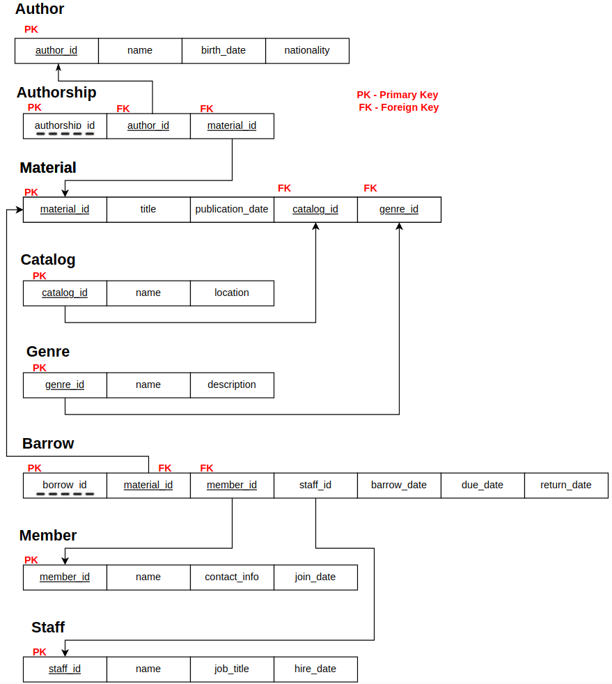

# Library Database Project 
The is a simple project that demonstrates concepts in fundamental database design and implementation. 

# Report
[project report](Project_Report.pdf)

# ER Diagram 

# Relational Mappings 

# Technologies & Concepts Used
- Postgres 
- ERD diagraming with Draw.io 
- Stored procedures 
- Views 
- Schema creation 
- Simple ETL process for data ingest
